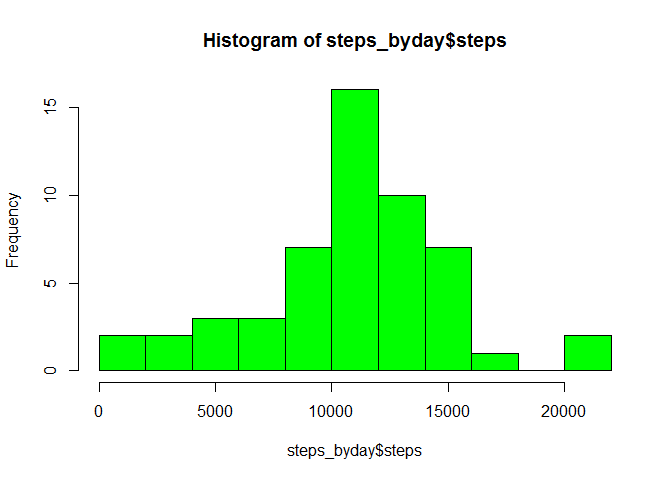
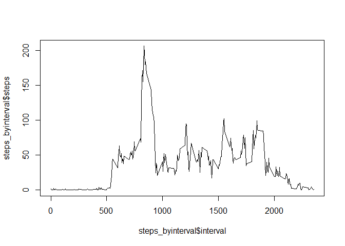
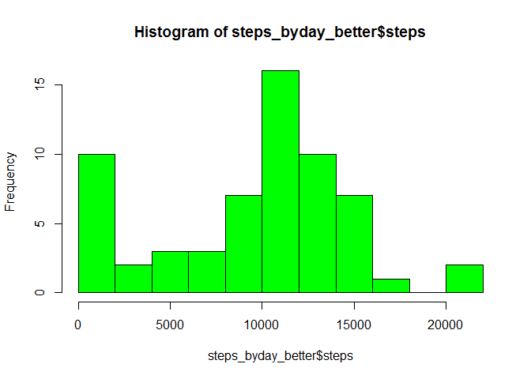

Reproducible Research - Course project 1
=======================================================

###Reading the CSV file


```r
library(dtplyr)
library(dplyr)
```

```
## 
## Attaching package: 'dplyr'
```

```
## The following objects are masked from 'package:stats':
## 
##     filter, lag
```

```
## The following objects are masked from 'package:base':
## 
##     intersect, setdiff, setequal, union
```

```r
activity_table <- read.csv("C:/Coursera_stuff/Reproducable Research (Course 5)/Course project 1/activity.csv")
```

###Q1: What is mean total number of steps taken per day?

Aggregate the steps taken by day:

```r
steps_byday <- aggregate(steps~date, activity_table, sum, na.rm=TRUE)
print(head(steps_byday))
```

```
##         date steps
## 1 2012-10-02   126
## 2 2012-10-03 11352
## 3 2012-10-04 12116
## 4 2012-10-05 13294
## 5 2012-10-06 15420
## 6 2012-10-07 11015
```
Sum of the steps taken:

```r
sum(steps_byday$steps)
```

```
## [1] 570608
```

Histogram of the activity:

```r
hist(steps_byday$steps, col = "green", breaks = 10)
```

<!-- -->

Mean of the steps by day:

```r
mean(steps_byday$steps)
```

```
## [1] 10766.19
```

Median of the steps by day:

```r
median(steps_byday$steps)
```

```
## [1] 10765
```

###Q2: What is the average daily activity pattern?

Aggregate the mean of the steps taken by interval:

```r
steps_byinterval <- aggregate(steps~interval, activity_table, mean, na.rm=TRUE)
print(head(steps_byinterval))
```

```
##   interval     steps
## 1        0 1.7169811
## 2        5 0.3396226
## 3       10 0.1320755
## 4       15 0.1509434
## 5       20 0.0754717
## 6       25 2.0943396
```

Plot the steps


```r
plot(steps_byinterval$steps~steps_byinterval$interval, type = "l")
```

<!-- -->

The interval with the highest number of steps:

```r
steps_byinterval[which.max(steps_byinterval$steps),]
```

```
##     interval    steps
## 104      835 206.1698
```

###Q3: Imputing missing values

Calculating the number of missing values

```r
sum(is.na(activity_table$steps))
```

```
## [1] 2304
```

Filling in the missing values.
In order to achieve a reasonable degree of accuracy, all the NA values will be filled in with the average number of steps for that particular day. If the whole day contains only missing values, then all the NAs will be filled in with 0.


```r
activity_better <- data.frame(steps=as.numeric(),
                              date=as.Date(character()),
                              interval=as.numeric(),
                              stringsAsFactors=FALSE)
dates <- unique(activity_table$date)
for(i in dates){
  xtable <- filter(activity_table, date==i)
  if(sum(complete.cases(xtable$steps))==0){
    xtable[is.na(xtable)] <- 0
  }
  else{
    xmean <- mean(xtable$steps)
  xtable[is.na(xtable)] <- xmean}
  activity_better <- rbind(activity_better, xtable)
} 
head(activity_better)
```

```
##   steps       date interval
## 1     0 2012-10-01        0
## 2     0 2012-10-01        5
## 3     0 2012-10-01       10
## 4     0 2012-10-01       15
## 5     0 2012-10-01       20
## 6     0 2012-10-01       25
```

Check that it has no missing values


```r
sum(is.na(activity_better$steps))
```

```
## [1] 0
```

Aggregate the steps taken by day in the new table:


```r
steps_byday_better <- aggregate(steps~date, activity_better, sum, na.rm=TRUE)
print(head(steps_byday_better))
```

```
##         date steps
## 1 2012-10-01     0
## 2 2012-10-02   126
## 3 2012-10-03 11352
## 4 2012-10-04 12116
## 5 2012-10-05 13294
## 6 2012-10-06 15420
```


Histogram of the activity:

```r
hist(steps_byday_better$steps, col = "green", breaks = 10)
```

<!-- -->

Mean of the steps by day:

```r
mean(steps_byday_better$steps)
```

```
## [1] 9354.23
```

Median of the steps by day:

```r
median(steps_byday_better$steps)
```

```
## [1] 10395
```

Filling in the NA values had a significant impact on the data. We can see that there are a lot more days in which no activity is recorded, and thus the mean and the median number of steps are reduced noticeably (particularly the mean).

###Q4: Are there differences in activity patterns between weekdays and weekends?

Adding a new column which specifies whether there is a weekday or weekend

```r
activity_better2 <- mutate(activity_better, date2=date)
activity_better2$date2 <- weekdays(as.Date(activity_better2$date2))
activity_better2 <- mutate(activity_better2, Datetype = as.factor(ifelse(date2 == "Saturday" | date2 == "Sunday", "weekend", "weekday")))
```

Plot the interval activity in the weekend and the weekdays

```r
library(lattice)
activity_better2_byinterval <- aggregate(steps ~ interval + Datetype, activity_better2, mean)
xyplot(steps ~ interval | factor(Datetype), data=activity_better2_byinterval, aspect=1/3, type="l")
```

<!-- -->

Subjects seem to be more active in the early part of the day during the weekdays, particularly around the 800 interval. 
During weekends we can see that there are larger peaks after the 1000 interval. This could be because people work during the weekdays (hence the increase up until interval 1000 when they reach the office), but then just stay put. Hence the increased activity after interval 1000 during weekends. 

